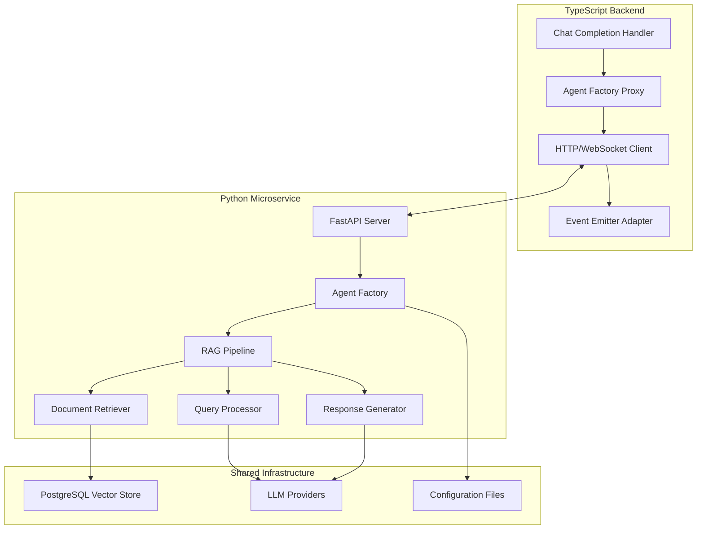
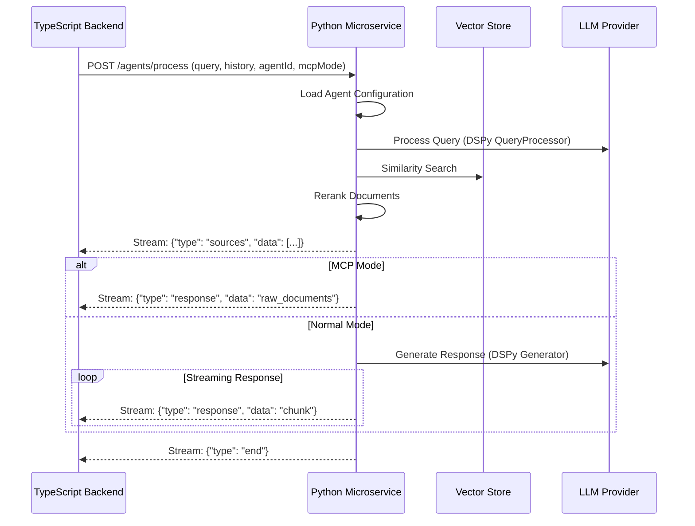

# Design Document

## Overview

This document describes the design for porting the Cairo Coder agents package from TypeScript to Python using the DSPy framework. The design maintains the same RAG pipeline architecture while leveraging Python's AI ecosystem through a microservice approach that communicates with the existing TypeScript backend.

## Architecture

### High-Level Architecture



### Communication Flow


## Components and Interfaces

### 1. FastAPI Microservice Server

**Purpose**: HTTP/WebSocket server that handles requests from TypeScript backend

**Interface**:
```python
class AgentServer:
    async def process_agent_request(
        self,
        query: str,
        chat_history: List[Message],
        agent_id: Optional[str] = None,
        mcp_mode: bool = False
    ) -> AsyncGenerator[Dict[str, Any], None]
```

**Key Features**:
- WebSocket support for real-time streaming
- Request validation and error handling
- CORS configuration for cross-origin requests
- Health check endpoints

### 2. Agent Factory

**Purpose**: Creates and configures agents based on agent ID or default configuration

**Interface**:
```python
class AgentFactory:
    @staticmethod
    def create_agent(
        query: str,
        history: List[Message],
        vector_store: VectorStore,
        mcp_mode: bool = False
    ) -> RagPipeline
    
    @staticmethod
    async def create_agent_by_id(
        query: str,
        history: List[Message],
        agent_id: str,
        vector_store: VectorStore,
        mcp_mode: bool = False
    ) -> RagPipeline
```

### 3. RAG Pipeline (DSPy-based)

**Purpose**: Orchestrates the three-stage RAG workflow using DSPy modules

**Interface**:
```python
class RagPipeline(dspy.Module):
    """Main pipeline that chains query processing, retrieval, and generation."""
    
    def __init__(self, config: RagSearchConfig):
        super().__init__()
        self.config = config
        
        # Initialize DSPy modules for each stage
        self.query_processor = QueryProcessor(config.retrieval_program)
        self.document_retriever = DocumentRetriever(config)
        self.response_generator = config.generation_program
    
    async def forward(
        self,
        query: str,
        chat_history: List[Message],
        mcp_mode: bool = False
    ) -> AsyncGenerator[StreamEvent, None]:
        """Execute the RAG pipeline with streaming support."""
        
        # Stage 1: Process query
        processed_query = self.query_processor(
            query=query,
            chat_history=self._format_history(chat_history)
        )
        
        # Stage 2: Retrieve documents
        documents = await self.document_retriever(
            processed_query=processed_query,
            sources=self.config.sources
        )
        
        # Emit sources event
        yield StreamEvent(type="sources", data=documents)
        
        if mcp_mode:
            # Return raw documents in MCP mode
            yield StreamEvent(type="response", data=self._format_documents(documents))
        else:
            # Stage 3: Generate response
            context = self._prepare_context(documents)
            response = self.response_generator(
                query=query,
                chat_history=self._format_history(chat_history),
                context=context
            )
            
            # Stream response chunks
            for chunk in self._chunk_response(response.answer):
                yield StreamEvent(type="response", data=chunk)
        
        yield StreamEvent(type="end", data=None)
```
### 4. DSPy Program Mappings

#### Query Processing Components

**Retrieval Signature** (maps from retrieval.program.ts):
```python
class CairoQueryAnalysis(dspy.Signature):
    """Analyze a Cairo programming query to extract search terms and identify relevant documentation sources."""
    
    chat_history = dspy.InputField(
        desc="Previous conversation context, may be empty",
        default=""
    )
    query = dspy.InputField(
        desc="User's Cairo/Starknet programming question"
    )
    search_terms = dspy.OutputField(
        desc="List of specific search terms to find relevant documentation"
    )
    resources = dspy.OutputField(
        desc="List of documentation sources from: cairo_book, starknet_docs, starknet_foundry, cairo_by_example, openzeppelin_docs, corelib_docs, scarb_docs"
    )

# Create the retrieval program
retrieval_program = dspy.ChainOfThought(CairoQueryAnalysis)
```

**QueryProcessor Module** (maps from queryProcessor.program.ts):
```python
class QueryProcessor(dspy.Module):
    """Processes user queries into structured format for retrieval."""
    
    def __init__(self, retrieval_program: dspy.Module):
        super().__init__()
        self.retrieval_program = retrieval_program
    
    def forward(self, query: str, chat_history: str = "") -> ProcessedQuery:
        # Execute the retrieval program
        result = self.retrieval_program(
            query=query,
            chat_history=chat_history
        )
        
        # Build ProcessedQuery matching TypeScript structure
        return ProcessedQuery(
            original=query,
            transformed=result.search_terms,
            is_contract_related=self._is_contract_query(query),
            is_test_related=self._is_test_query(query),
            resources=self._validate_resources(result.resources)
        )
    
    def _is_contract_query(self, query: str) -> bool:
        """Check if query is about smart contracts."""
        contract_keywords = ['contract', 'interface', 'trait', 'impl', 'storage']
        return any(kw in query.lower() for kw in contract_keywords)
    
    def _is_test_query(self, query: str) -> bool:
        """Check if query is about testing."""
        test_keywords = ['test', 'testing', 'assert', 'mock', 'fixture']
        return any(kw in query.lower() for kw in test_keywords)
    
    def _validate_resources(self, resources: List[str]) -> List[DocumentSource]:
        """Validate and convert resource strings to DocumentSource enum."""
        valid_resources = []
        for r in resources:
            try:
                valid_resources.append(DocumentSource(r))
            except ValueError:
                continue
        return valid_resources or [DocumentSource.CAIRO_BOOK]  # Default fallback
```

#### Document Retrieval Component

**DocumentRetriever Module** (maps from documentRetriever.program.ts):
```python
class DocumentRetriever(dspy.Module):
    """Retrieves and ranks relevant documents from vector store."""
    
    def __init__(self, config: RagSearchConfig):
        super().__init__()
        self.config = config
        self.vector_store = config.vector_store
        self.embedder = dspy.Embedder(model="text-embedding-3-large")
    
    async def forward(
        self,
        processed_query: ProcessedQuery,
        sources: List[DocumentSource]
    ) -> List[Document]:
        """Three-step retrieval process: fetch, rerank, attach metadata."""
        
        # Step 1: Fetch documents (maps to fetchDocuments)
        docs = await self._fetch_documents(processed_query, sources)
        
        # Step 2: Rerank documents (maps to rerankDocuments)
        if docs:
            docs = await self._rerank_documents(processed_query.original, docs)
        
        # Step 3: Attach sources (maps to attachSources)
        return self._attach_sources(docs)
    
    async def _fetch_documents(
        self,
        processed_query: ProcessedQuery,
        sources: List[DocumentSource]
    ) -> List[Document]:
        """Fetch documents from vector store."""
        return await self.vector_store.similarity_search(
            query=processed_query.original,
            k=self.config.max_source_count,
            sources=sources
        )
    
    async def _rerank_documents(
        self,
        query: str,
        docs: List[Document]
    ) -> List[Document]:
        """Rerank documents by cosine similarity."""
        # Get embeddings
        query_embedding = await self.embedder.embed([query])
        doc_texts = [d.page_content for d in docs]
        doc_embeddings = await self.embedder.embed(doc_texts)
        
        # Calculate similarities
        similarities = []
        for doc_emb in doc_embeddings:
            similarity = self._cosine_similarity(query_embedding[0], doc_emb)
            similarities.append(similarity)
        
        # Filter by threshold and sort
        ranked_docs = [
            (doc, sim) for doc, sim in zip(docs, similarities)
            if sim >= self.config.similarity_threshold
        ]
        ranked_docs.sort(key=lambda x: x[1], reverse=True)
        
        return [doc for doc, _ in ranked_docs[:self.config.max_source_count]]
    
    def _cosine_similarity(self, a: List[float], b: List[float]) -> float:
        """Calculate cosine similarity between two vectors."""
        import numpy as np
        return np.dot(a, b) / (np.linalg.norm(a) * np.linalg.norm(b))
    
    def _attach_sources(self, docs: List[Document]) -> List[Document]:
        """Attach metadata like title and URL to documents."""
        for doc in docs:
            # Add source metadata based on document source
            source = doc.metadata.get('source', '')
            doc.metadata['title'] = self._get_title(doc)
            doc.metadata['url'] = self._get_url(doc)
        return docs
```

#### Generation Components

**Cairo Generation Signature** (maps from generation.program.ts):
```python
class CairoCodeGeneration(dspy.Signature):
    """Generate Cairo smart contract code based on context and user query."""
    
    chat_history = dspy.InputField(
        desc="Previous conversation context for continuity"
    )
    query = dspy.InputField(
        desc="User's specific Cairo programming question or request"
    )
    context = dspy.InputField(
        desc="Retrieved Cairo documentation, examples, and relevant information"
    )
    answer = dspy.OutputField(
        desc="Complete Cairo code solution with explanations, following Cairo syntax and best practices"
    )

# Create generation program with Chain of Thought reasoning
generation_program = dspy.ChainOfThought(
    CairoCodeGeneration,
    rationale_field=dspy.OutputField(
        prefix="Reasoning: Let me analyze the Cairo requirements step by step.",
        desc="Step-by-step analysis of the Cairo programming task"
    )
)
```

**Scarb-specific Programs** (maps from scarb-*.program.ts):
```python
class ScarbQueryAnalysis(dspy.Signature):
    """Analyze Scarb build tool queries to extract relevant search terms."""
    
    chat_history = dspy.InputField(desc="Previous conversation", default="")
    query = dspy.InputField(desc="User's Scarb-related question")
    search_terms = dspy.OutputField(
        desc="Scarb-specific search terms (commands, configuration, dependencies)"
    )
    resources = dspy.OutputField(
        desc="Always includes 'scarb_docs' as primary source"
    )

class ScarbGeneration(dspy.Signature):
    """Generate Scarb configuration, commands, and troubleshooting guidance."""
    
    chat_history = dspy.InputField(desc="Previous conversation")
    query = dspy.InputField(desc="User's Scarb question")
    context = dspy.InputField(desc="Scarb documentation and examples")
    answer = dspy.OutputField(
        desc="Scarb commands, TOML configurations, or troubleshooting steps with proper formatting"
    )

# Create Scarb-specific programs
scarb_retrieval_program = dspy.ChainOfThought(ScarbQueryAnalysis)
scarb_generation_program = dspy.ChainOfThought(ScarbGeneration)
```

#### Loading Optimized Configurations

```python
def load_optimized_programs(programs_dir: str = "optimized_programs"):
    """Load DSPy programs with pre-optimized prompts and demonstrations."""
    
    programs = {}
    
    # Load each optimized program
    for program_name in ['retrieval', 'generation', 'scarb_retrieval', 'scarb_generation']:
        program_path = os.path.join(programs_dir, f"{program_name}.json")
        
        if os.path.exists(program_path):
            # Load optimized program with learned prompts and demos
            programs[program_name] = dspy.load(program_path)
        else:
            # Fallback to base programs
            if program_name == 'retrieval':
                programs[program_name] = retrieval_program
            elif program_name == 'generation':
                programs[program_name] = generation_program
            elif program_name == 'scarb_retrieval':
                programs[program_name] = scarb_retrieval_program
            elif program_name == 'scarb_generation':
                programs[program_name] = scarb_generation_program
    
    return programs
```
### 5. Vector Store Integration

**Purpose**: Interface with PostgreSQL vector database for document retrieval

**Interface**:
```python
class VectorStore:
    def __init__(self, config: VectorStoreConfig):
        self.pool = asyncpg.create_pool(...)
        self.embedding_client = OpenAIEmbeddings()
    
    async def similarity_search(
        self,
        query: str,
        k: int = 5,
        sources: Optional[Union[DocumentSource, List[DocumentSource]]] = None
    ) -> List[Document]
    
    async def add_documents(
        self,
        documents: List[Document],
        ids: Optional[List[str]] = None
    ) -> None
```

### 6. LLM Configuration with DSPy

**Purpose**: Configure and manage multiple LLM providers through DSPy's unified interface

**Implementation**:
```python
class LLMConfig:
    """Manages LLM configuration for DSPy."""
    
    @staticmethod
    def configure_providers(config: Config) -> Dict[str, dspy.LM]:
        """Configure all available LLM providers."""
        providers = {}
        
        # Configure OpenAI
        if config.openai_api_key:
            providers['openai'] = dspy.LM(
                model=config.openai_model or "openai/gpt-4o",
                api_key=config.openai_api_key,
                temperature=config.temperature
            )
        
        # Configure Anthropic
        if config.anthropic_api_key:
            providers['anthropic'] = dspy.LM(
                model=config.anthropic_model or "anthropic/claude-3-5-sonnet",
                api_key=config.anthropic_api_key,
                temperature=config.temperature
            )
        
        # Configure Google Gemini
        if config.gemini_api_key:
            providers['gemini'] = dspy.LM(
                model=config.gemini_model or "google/gemini-1.5-pro",
                api_key=config.gemini_api_key,
                temperature=config.temperature
            )
        
        return providers
    
    @staticmethod
    def set_default_lm(providers: Dict[str, dspy.LM], default: str = "openai"):
        """Set the default LM for all DSPy operations."""
        if default in providers:
            dspy.configure(lm=providers[default])
        elif providers:
            # Fallback to first available provider
            dspy.configure(lm=next(iter(providers.values())))
        else:
            raise ValueError("No LLM providers configured")

# Usage in initialization
class AgentInitializer:
    def __init__(self, config: Config):
        # Configure LLM providers
        self.providers = LLMConfig.configure_providers(config)
        LLMConfig.set_default_lm(self.providers, config.default_provider)
        
        # Configure embeddings separately if needed
        self.embedder = dspy.Embedder(
            model=config.embedding_model or "text-embedding-3-large",
            api_key=config.openai_api_key  # Embeddings typically use OpenAI
        )
```

**Streaming Support**:
```python
from dspy.utils import streamify

class StreamingPipeline:
    """Wrapper for streaming DSPy module responses."""
    
    def __init__(self, module: dspy.Module):
        self.module = module
        self.streaming_module = streamify(module)
    
    async def stream_response(
        self,
        **kwargs
    ) -> AsyncGenerator[str, None]:
        """Stream response chunks from the module."""
        async for chunk in self.streaming_module(**kwargs):
            yield chunk
```

### 7. Configuration Management

**Purpose**: Load and manage configuration from TOML files and environment variables

**Interface**:
```python
class ConfigManager:
    @staticmethod
    def load_config() -> Config:
        # Load from config.toml and environment variables
        pass
    
    @staticmethod
    def get_agent_config(agent_id: str) -> AgentConfiguration:
        # Load agent-specific configuration
        pass
```## Da
ta Models

### Core Data Structures

```python
@dataclass
class ProcessedQuery:
    original: str
    transformed: Union[str, List[str]]
    is_contract_related: bool = False
    is_test_related: bool = False
    resources: List[DocumentSource] = field(default_factory=list)

@dataclass
class Document:
    page_content: str
    metadata: Dict[str, Any]

@dataclass
class RagInput:
    query: str
    chat_history: List[Message]
    sources: Union[DocumentSource, List[DocumentSource]]

@dataclass
class StreamEvent:
    type: str  # "sources", "response", "end", "error"
    data: Any

@dataclass
class RagSearchConfig:
    name: str
    vector_store: VectorStore
    contract_template: Optional[str] = None
    test_template: Optional[str] = None
    max_source_count: int = 10
    similarity_threshold: float = 0.4
    sources: Union[DocumentSource, List[DocumentSource]] = None
    retrieval_program: dspy.Module = None
    generation_program: dspy.Module = None

class DocumentSource(Enum):
    CAIRO_BOOK = "cairo_book"
    STARKNET_DOCS = "starknet_docs"
    STARKNET_FOUNDRY = "starknet_foundry"
    CAIRO_BY_EXAMPLE = "cairo_by_example"
    OPENZEPPELIN_DOCS = "openzeppelin_docs"
    CORELIB_DOCS = "corelib_docs"
    SCARB_DOCS = "scarb_docs"
```
## Error Handling
### Error Categories

1. **Configuration Errors**: Missing API keys, invalid agent IDs
2. **Database Errors**: Connection failures, query errors
3. **LLM Provider Errors**: Rate limits, API failures
4. **Validation Errors**: Invalid input parameters
5. **Processing Errors**: Pipeline execution failures

### Error Response Format

```python
@dataclass
class ErrorResponse:
    type: str  # "configuration_error", "database_error", etc.
    message: str
    details: Optional[Dict[str, Any]] = None
    timestamp: datetime = field(default_factory=datetime.now)
```

## Testing Strategy

### Unit Testing with DSPy

**Testing DSPy Modules**:
```python
import pytest
import dspy
from unittest.mock import Mock, patch

class TestQueryProcessor:
    @pytest.fixture
    def mock_lm(self):
        """Configure DSPy with a mock LM for testing."""
        mock = Mock()
        mock.return_value = dspy.Prediction(
            search_terms=["cairo", "contract", "storage"],
            resources=["cairo_book", "starknet_docs"]
        )
        dspy.configure(lm=mock)
        return mock
    
    def test_query_processing(self, mock_lm):
        """Test query processor extracts correct search terms."""
        processor = QueryProcessor(retrieval_program)
        result = processor(
            query="How do I define storage in a Cairo contract?",
            chat_history=""
        )
        
        assert result.is_contract_related == True
        assert "cairo_book" in [r.value for r in result.resources]
        assert len(result.transformed) > 0

class TestDocumentRetriever:
    @pytest.mark.asyncio
    async def test_document_ranking(self):
        """Test document reranking by similarity."""
        # Mock vector store
        mock_store = Mock()
        mock_store.similarity_search.return_value = [
            Document(page_content="Cairo storage guide", metadata={"score": 0.9}),
            Document(page_content="Irrelevant content", metadata={"score": 0.3})
        ]
        
        config = RagSearchConfig(
            name="test",
            vector_store=mock_store,
            similarity_threshold=0.5
        )
        
        retriever = DocumentRetriever(config)
        # Test retrieval and ranking
        # ...
```

**Testing with DSPy Assertions**:
```python
def test_generation_quality():
    """Test generation produces valid Cairo code."""
    # Create test examples
    examples = [
        dspy.Example(
            query="Write a simple Cairo contract",
            context="Cairo contracts use #[contract] attribute...",
            answer="#[contract]\nmod SimpleContract {\n    ..."
        ).with_inputs("query", "context")
    ]
    
    # Use DSPy's evaluation tools
    evaluator = dspy.Evaluate(
        devset=examples,
        metric=cairo_code_validity_metric
    )
    
    score = evaluator(generation_program)
    assert score > 0.8  # 80% accuracy threshold
```

### Integration Testing

**End-to-End Pipeline Test**:
```python
@pytest.mark.integration
class TestRagPipeline:
    async def test_full_pipeline_flow(self):
        """Test complete RAG pipeline execution."""
        # Configure test environment
        dspy.configure(lm=dspy.LM("openai/gpt-3.5-turbo", api_key="test"))
        
        # Create pipeline with test config
        config = RagSearchConfig(
            name="test_agent",
            vector_store=test_vector_store,
            retrieval_program=retrieval_program,
            generation_program=generation_program
        )
        
        pipeline = RagPipeline(config)
        
        # Execute pipeline
        events = []
        async for event in pipeline.forward(
            query="How to create a Cairo contract?",
            chat_history=[]
        ):
            events.append(event)
        
        # Verify event sequence
        assert events[0].type == "sources"
        assert any(e.type == "response" for e in events)
        assert events[-1].type == "end"
```

### Performance Testing with DSPy

**Optimization and Benchmarking**:
```python
class PerformanceTests:
    def test_pipeline_optimization(self):
        """Test and optimize pipeline performance."""
        # Create training set for optimization
        trainset = load_cairo_training_examples()
        
        # Optimize with MIPROv2
        optimizer = dspy.MIPROv2(
            metric=cairo_accuracy_metric,
            auto="light"  # Fast optimization for testing
        )
        
        # Measure optimization time
        start_time = time.time()
        optimized = optimizer.compile(
            pipeline,
            trainset=trainset[:50]  # Subset for testing
        )
        optimization_time = time.time() - start_time
        
        assert optimization_time < 300  # Should complete within 5 minutes
        
        # Benchmark optimized vs unoptimized
        unopt_score = evaluate_pipeline(pipeline, testset)
        opt_score = evaluate_pipeline(optimized, testset)
        
        assert opt_score > unopt_score  # Optimization should improve performance
    
    @pytest.mark.benchmark
    def test_request_throughput(self, benchmark):
        """Benchmark request processing throughput."""
        pipeline = create_test_pipeline()
        
        async def process_request():
            async for _ in pipeline.forward(
                query="Simple Cairo query",
                chat_history=[]
            ):
                pass
        
        # Run benchmark
        result = benchmark(asyncio.run, process_request)
        
        # Assert performance requirements
        assert result.stats['mean'] < 2.0  # Average < 2 seconds
```

### Mock Strategies for DSPy

```python
class MockDSPyLM:
    """Mock LM for testing without API calls."""
    
    def __init__(self, responses: Dict[str, Any]):
        self.responses = responses
        self.call_count = 0
    
    def __call__(self, prompt: str, **kwargs):
        self.call_count += 1
        # Return predetermined responses based on prompt content
        for key, response in self.responses.items():
            if key in prompt:
                return dspy.Prediction(**response)
        return dspy.Prediction(answer="Default response")

# Usage in tests
def test_with_mock_lm():
    mock_lm = MockDSPyLM({
        "storage": {"search_terms": ["storage", "variable"], "resources": ["cairo_book"]},
        "contract": {"answer": "#[contract]\nmod Example {...}"}
    })
    
    dspy.configure(lm=mock_lm)
    # Run tests...
```