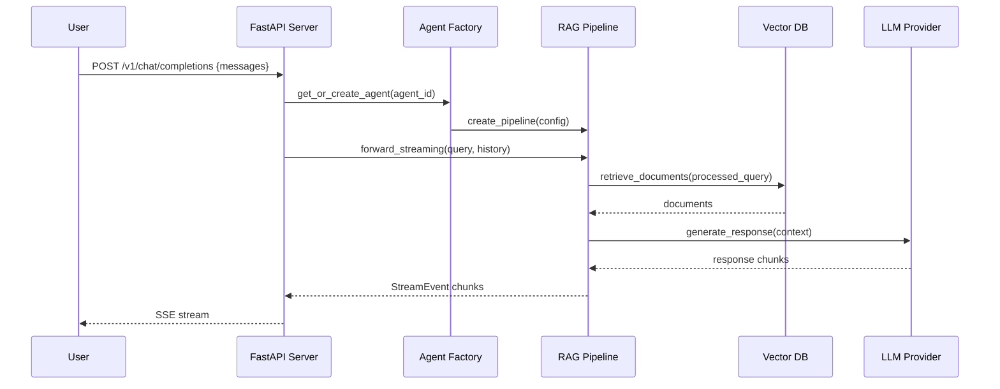
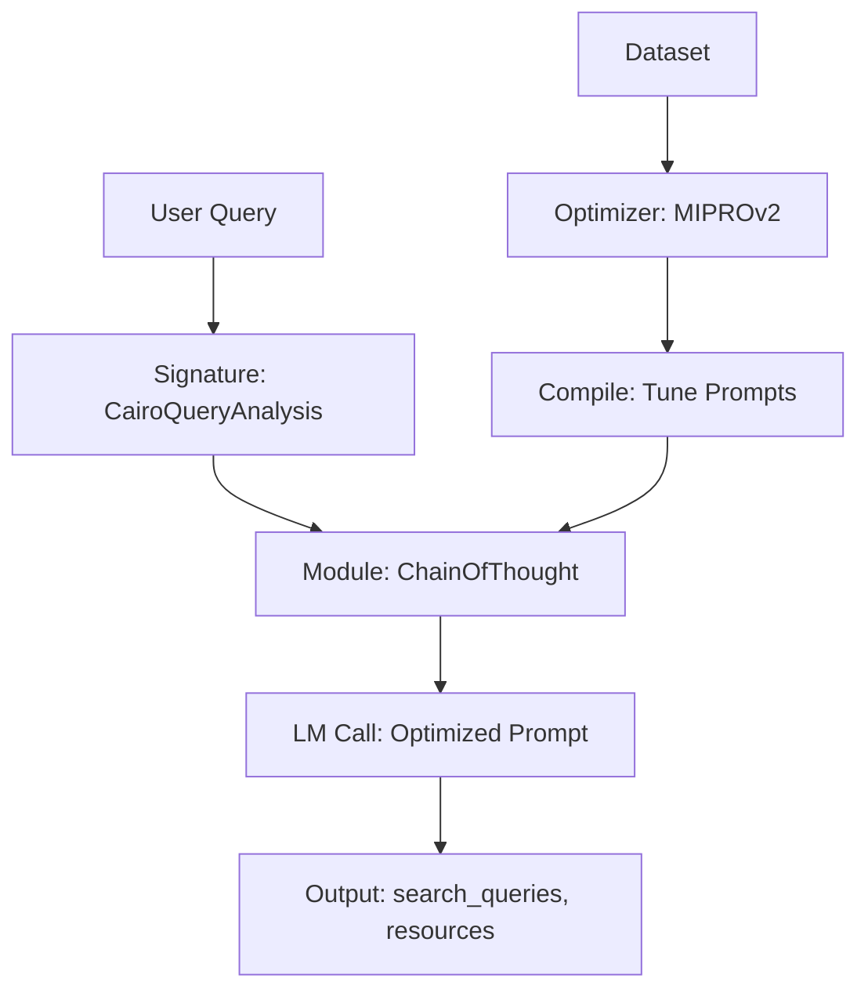
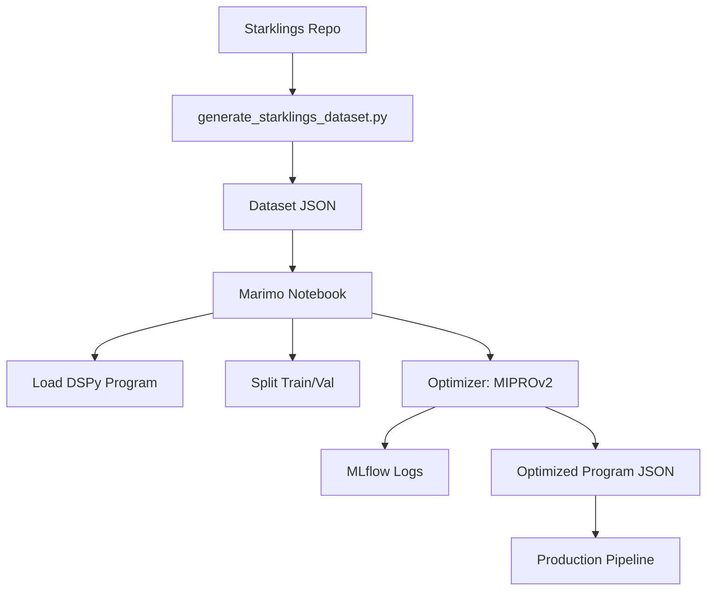

# Architecture of Cairo Coder

## Introduction

Cairo Coder is an open-source AI-powered code generation service designed specifically for the Cairo programming language, which is used for developing provable programs and smart contracts on the Starknet blockchain. The primary goal of Cairo Coder is to accelerate Cairo development by transforming natural language descriptions into high-quality, functional Cairo code. This is achieved through an advanced Retrieval-Augmented Generation (RAG) pipeline that leverages up-to-date documentation from various Cairo and Starknet sources to inform code generation.

The project addresses key challenges in Cairo development:

- Cairo's unique syntax and concepts (e.g., felt252 types, storage patterns, contract attributes) can be difficult for newcomers.
- The ecosystem is evolving rapidly, with frequent updates to tools like Scarb, Starknet Foundry, and libraries like OpenZeppelin Cairo Contracts.
- Developers need accurate, context-aware code suggestions that adhere to best practices and compile successfully.

Cairo Coder provides an OpenAI-compatible API endpoint, making it easy to integrate into IDEs, chat interfaces, or custom tools. It supports multiple specialized "agents" for different aspects of Cairo development (e.g., general coding, Scarb configuration, Starknet-specific features). The system is built to be optimizable, allowing maintainers to fine-tune prompts and pipelines using DSPy and datasets derived from exercises like Starklings.

This document serves as a comprehensive design guide for maintainers. It covers the technology stack, high-level architecture, key components like the DSPy framework, optimization workflows, testing strategies, and additional operational details. Diagrams are provided using Mermaid for clarity.

## Technology Stack and Toolchain

Cairo Coder is implemented in Python 3.10+, leveraging a modern stack optimized for AI pipelines, web services, and data processing. The choice of Python stems from its rich ecosystem for AI/ML, particularly with frameworks like DSPy, which enable structured prompt engineering.

### Core Technologies

- **Python 3.10+**: Primary language for the backend, chosen for its async capabilities (asyncio), type hints, and ecosystem maturity.
- **DSPy (2.5.0+)**: Framework for programming language models with structured signatures, optimizable prompts, and RAG pipelines. DSPy abstracts away raw prompt engineering, allowing maintainers to define "programs" as composable modules (e.g., query processing, retrieval, generation) that can be optimized automatically.
- **FastAPI (0.115.0+)**: Web framework for the API server, providing async endpoints, automatic OpenAPI docs, and WebSocket support for streaming responses.
- **PostgreSQL with pgvector**: Vector database for storing and querying document embeddings. Uses cosine similarity for efficient retrieval.
- **Uvicorn**: ASGI server for running FastAPI in production with worker processes.
- **LiteLLM/DSPy LM Providers**: Abstracts LLM calls to providers like OpenAI (GPT series), Anthropic (Claude), and Google (Gemini). Supports token tracking and cost estimation.
- **Structlog**: Structured logging for JSON/text output, with processors for timestamps and exception formatting.
- **Pydantic**: Data validation and settings management, ensuring type-safe configurations and API models.
- **Asyncpg**: Asynchronous PostgreSQL driver for non-blocking database operations.

### Toolchain

The project uses **uv** (from Astral) as the primary toolchain for Python dependency management, virtual environments, and scripting. uv is chosen over pip/poetry for its speed (Rust-based) and simplicity:

- **Installation**: `curl -LsSf https://astral.sh/uv/install.sh | sh`
- **Virtual Env**: `uv venv` creates isolated environments.
- **Dependencies**: `uv pip install -e ".[dev]"` installs runtime and dev deps from pyproject.toml.
- **Scripts**: Defined in pyproject.toml (e.g., `uv run cairo-coder-api` starts the server).
- **Testing**: Integrated with pytest via `uv run pytest`.

Other tools:

- **Ruff**: Linting and formatting (replaces flake8, isort, etc.).
- **Black**: Code formatting.
- **Mypy**: Static type checking.
- **Pytest**: Testing framework with async support (pytest-asyncio).
- **Marimo**: Reactive notebooks for optimization workflows (e.g., DSPy optimizers).
- **MLflow**: Experiment tracking for DSPy optimizations (autologs prompts, metrics).
- **Pre-commit**: Git hooks for linting/type-checking on commit.

This stack ensures high performance (async I/O for API/DB), maintainability (type-safe code), and scalability (worker processes, vector DB).

```mermaid
graph TD
    A[User Query] --> B[FastAPI Server]
    B --> C[DSPy RAG Pipeline]
    C --> D[Query Processor]
    D --> E[Document Retriever]
    E --> F[PostgreSQL + pgvector]
    C --> G[Generation Program]
    G --> H[LLM Provider<br>(OpenAI/Anthropic/Gemini)]
    B --> I[Streaming Response]
    J[Optimizer Notebook<br>(Marimo/MLflow)] --> C
    K[Tests (Pytest)] --> B
    L[Toolchain (uv/Ruff/Black)] --> M[Development]
```

## Project Goal and High-Level Architecture

Cairo Coder's goal is to democratize Cairo development by providing an intelligent code generation service that:

- Understands natural language queries (e.g., "Create an ERC20 token with minting").
- Retrieves relevant documentation from sources like Cairo Book, Starknet Docs, Scarb, OpenZeppelin.
- Generates compilable Cairo code with explanations, following best practices.
- Supports specialized agents (e.g., for Scarb config, Starknet deployment).
- Is optimizable to improve accuracy over time using datasets like Starklings exercises.

The architecture is a microservice-based RAG pipeline wrapped in a FastAPI server. It replicates the TypeScript backend's OpenAI-compatible API for drop-in compatibility, while using DSPy for the core logic.

### High-Level Components

1. **API Layer (FastAPI)**: Handles HTTP/WebSocket requests. Endpoints include `/v1/chat/completions` (legacy) and `/v1/agents/{id}/chat/completions` (agent-specific). Supports streaming and MCP mode (raw docs).
2. **Agent Factory**: Creates/manages agents based on configs. Each agent is a specialized RAG pipeline.
3. **RAG Pipeline (DSPy)**: Core workflow:
   - Query Processing: Extracts search terms, identifies resources.
   - Document Retrieval: Queries vector DB, reranks results.
   - Generation: Produces code using context.
4. **Vector Store (PostgreSQL/pgvector)**: Stores embedded docs from ingester.
5. **Optimizers**: Marimo notebooks for DSPy optimization using metrics like compilation success.

The pipeline is async for low-latency streaming. Requests flow: API → Agent → Pipeline → LLM/DB.



### Backend API Specification

The API mimics OpenAI's Chat Completions:

- **POST /v1/chat/completions**: Legacy endpoint. Body: `{messages: [{role, content}], stream: bool}`. Response: OpenAI-compatible JSON or SSE stream.
- **POST /v1/agents/{agent_id}/chat/completions**: Agent-specific. Same body/response.
- **GET /v1/agents**: List agents: `[{id, name, description, sources}]`.
- Headers: `x-mcp-mode: true` for raw docs (MCP mode).
- Streaming: SSE with `data: {id, object: "chat.completion.chunk", choices: [{delta: {content}}]}`.

Error responses: `{error: {message, type, code}}` (e.g., 404 for invalid agent).

## DSPy Framework Details

DSPy is a programming framework for language models that shifts focus from raw prompt engineering to structured "programs" composed of modules. Unlike traditional prompt chaining (e.g., LangChain), DSPy treats prompts as optimizable code with typed inputs/outputs, enabling compilation against datasets.

### Key DSPy Concepts

- **Signatures**: Define strongly typed prompt interfaces as Pydantic models. E.g.:

  ```python
  class CairoCodeGeneration(dspy.Signature):
      query: str = dspy.InputField(desc="User's Cairo question")
      context: str = dspy.InputField(desc="Retrieved docs")
      answer: str = dspy.OutputField(desc="Cairo code with explanations")
  ```

  Inputs are prompts; outputs are generated. DSPy enforces types (str, List[str], etc.) and descriptions for few-shot examples.

- **Modules**: Composable building blocks:

  - `ChainOfThought`: Adds reasoning step (rationale field).
  - `Retrieve`: Interfaces with retrievers (e.g., our PgVectorRM).
  - Custom: Like our `RagPipeline` chaining query → retrieve → generate.

- **Optimizers**: Automatically tune prompts/modules using datasets and metrics. E.g., MIPROv2 generates/optimizes few-shot examples via bootstrapping/teleprompting.

- **Strongly Typed Prompts**: Unlike string templates, DSPy signatures ensure:
  - Input validation (e.g., query must be str).
  - Output parsing (e.g., extract `answer` from LLM response).
  - Few-shot learning: Auto-generates examples from signatures.

From web search on "DSPy framework strongly typed prompt inputs outputs":

- DSPy compiles programs into optimized prompts, caching compilations.
- Typed signatures enable metric-based optimization (e.g., F1 score on outputs).
- Supports multi-LLM (OpenAI, etc.) and caching for efficiency.
- Key benefit: Reduces brittle prompt hacking; code-like abstraction.

In Cairo Coder, DSPy enables:

- Modular pipeline: Separate query processing (`CairoQueryAnalysis`), retrieval, generation.
- Optimization: Tune against Starklings dataset for better code compilation rates.



## Optimizers and Marimo Notebooks

Optimizers improve pipeline accuracy by tuning DSPy modules against datasets. We use Starklings exercises (Cairo puzzles) to generate datasets for metrics like code compilation success.

### Optimization Workflow

1. **Dataset Generation**: Script `generate_starklings_dataset.py` clones Starklings, extracts exercises/solutions, uses RAG to create query-context-expected triples.
2. **Metrics**: Custom DSPy metrics (e.g., `generation_metric`): Extract code, check compilation via Scarb.
3. **Optimizers**: DSPy MIPROv2 for few-shot prompt tuning.
4. **Evaluation**: Baseline vs. optimized scores on train/val splits.

### Marimo Notebooks

Marimo provides reactive Jupyter-like notebooks for optimization:

- Cells isolate steps (e.g., load dataset, init program, run optimizer).
- Reactive: Changing a cell auto-reruns dependents.
- MLflow integration: Logs experiments (prompts, metrics, costs).

Notebooks:

- `generation_optimizer.py`: Optimizes `GenerationProgram`.
- `retrieval_optimizer.py`: Optimizes query processing.
- `rag_pipeline_optimizer.py`: End-to-end pipeline.

To run: `marimo run optimizers/generation_optimizer.py`. Outputs: Optimized JSON files in `optimizers/results/`.



## How to Write Tests, Mock Tests, and Test Structure

Testing ensures reliability. We use pytest with async support.

### Test Structure

- `tests/unit/`: Isolated component tests (e.g., `test_query_processor.py`).
- `tests/integration/`: End-to-end flows (e.g., `test_server_integration.py`).
- `conftest.py`: Shared fixtures (mocks for DB, LM, etc.).
- Coverage: Aim for 80%+ on core modules.

### Writing Tests

- **Unit Tests**: Mock dependencies (e.g., LM responses via `mock_lm` fixture).
- **Async Tests**: Use `@pytest.mark.asyncio` and `await` for coroutines.
- **Fixtures**: Use `pytest.fixture` for setup (e.g., mock DB pools).
- **Assertions**: Verify outputs, side effects (e.g., DB calls).
- **Error Handling**: Test exceptions with `pytest.raises`.

### Mocking Tests

- **DSPy LM**: Mock `dspy.LM` to return fixed predictions.
- **DB**: Mock `asyncpg` pool with `mock_pool` fixture.
- **Agents**: Mock `AgentFactory` to return configurable agents.
- **Patch**: Use `unittest.mock.patch` for external calls (e.g., OpenAI).

Example:

```python
@pytest.mark.asyncio
async def test_pipeline(pipeline):
    events = [e async for e in pipeline.forward_streaming("query")]
    assert any(e.type == "response" for e in events)
```

Run: `uv run pytest --cov=src/cairo_coder`.

## Other Useful Information

### Deployment

- Docker: `docker compose up` for Postgres + API.
- Scaling: Uvicorn workers (`--workers 4`).
- Monitoring: Structlog JSON logs; MLflow for experiments.

### Maintenance Tips

- Update DSPy: Check for new optimizers.
- Add Agents: Extend `AgentConfiguration` in config.
- Dataset Expansion: Add more Starklings-like sources.
- Security: Validate API keys; rate-limit endpoints.

### Future Enhancements

- Multi-LLM routing based on query.
- Real-time doc updates via ingester webhooks.
- UI integration for code previews.

This architecture ensures Cairo Coder is robust, optimizable, and maintainer-friendly. For questions, open issues on GitHub.
